# **Lapres Praktikum Jarkom Modul 5 Kelompok D15**

### **Anggota Kelompok**

| **Nama**                  | **NRP**    |
| ------------------------- | ---------- |
| Rayhan Arvianta Bayuputra | 5025211217 |
| Yehezkiel Wiradhika       | 5025201086 |

## Daftar Isi

- [Prerequisites](#Prerequisites)
  - [Setup Topologi](#Setup-Topologi)
  - [Subnetting dengan VLSM](#Subnetting-dengan-VLSM)
  - [Routing](#Routing)
  - [Setup DHCP](#Setup-DHCP)
- [Soal 1](#Soal-1)
- [Soal 2](#Soal-2)
- [Soal 3](#Soal-3)
- [Soal 4](#Soal-4)
- [Soal 5](#Soal-5)
- [Soal 6](#Soal-6)
- [Soal 7](#Soal-7)
- [Soal 8](#Soal-8)
- [Soal 9](#Soal-9)
- [Soal 10](#Soal-10)

## Prerequisites

Berikut adalah hal yang harus disiapkan sebelum terjun ke soal-soal

### Setup Topologi

(foto topologi di gns3, tolong masukin mas gns3 ku dead)

Dengan keterangan

- Richter adalah DNS Server
- Revolte adalah DHCP Server
- Sein dan Stark adalah Web Server
- Jumlah Host pada SchwerMountain adalah 64
- Jumlah Host pada LaubHills adalah 255
- Jumlah Host pada TurkRegion adalah 1022
- Jumlah Host pada GrobeForest adalah 512

### Subnetting dengan VLSM

Sheet subnetting dapat diakses lewat link <a href="https://docs.google.com/spreadsheets/d/16ojlqLXfdEohJvJMFsAyd2HqNdLfOEMsJbRg7eYrSY4/edit?usp=sharing">berikut</a>.

Berdasarkan informasi dari soal, dapat dihitung jumlah IP yang dibutuhkan oleh setiap subnet, beserta length yang optimal untuk jumlah IP yang terkait.

| Nama Subnet | Rute                                               | Jumlah IP | Netmask |
| ----------- | -------------------------------------------------- | --------- | ------- |
| A1          | Fern - Switch2 - Revolte                           | 2         | /30     |
| A2          | Fern - Richter                                     | 2         | /30     |
| A3          | Himmel - Switch3 - SchwerMountain - Switch3 - Fern | 66        | /25     |
| A4          | Himmel - LaubHills                                 | 256       | /23     |
| A5          | Frieren - Himmel                                   | 2         | /30     |
| A6          | Frieren - Stark                                    | 2         | /30     |
| A7          | Aura - Frieren                                     | 2         | /30     |
| A8          | Aura - Heiter                                      | 2         | /30     |
| A9          | Heiter - TurkRegion                                | 1023      | /21     |
| A10         | Heiter - Switch1 - Sein - Switch1 - GrobeForest    | 514       | /22     |
| Total       |                                                    | 1871      | /21     |

Dan dari informasi pada tabel di atas, dapat dibentuk VLSM tree seperti berikut.

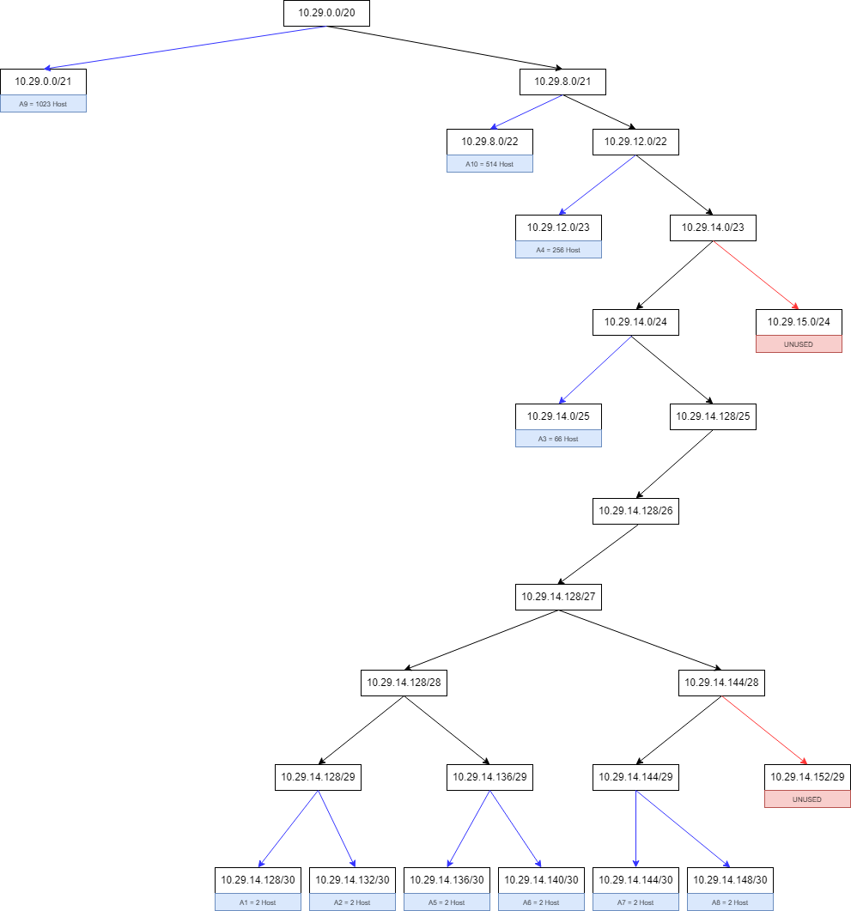

Hasil subnetting dari VLSM tree di atas dapat dipetakan pada tabel berikut.

| Subnet | Network ID   | Netmask         | Broadcast    |
| ------ | ------------ | --------------- | ------------ |
| A1     | 10.29.14.128 | 255.255.255.252 | 10.29.14.131 |
| A2     | 10.29.14.132 | 255.255.255.252 | 10.29.14.135 |
| A3     | 10.29.14.0   | 255.255.255.128 | 10.29.14.127 |
| A4     | 10.29.12.0   | 255.255.254.0   | 10.29.13.255 |
| A5     | 10.29.14.136 | 255.255.255.252 | 10.29.14.139 |
| A6     | 10.29.14.140 | 255.255.255.252 | 10.29.14.143 |
| A7     | 10.29.14.144 | 255.255.255.252 | 10.29.14.147 |
| A8     | 10.29.14.148 | 255.255.255.252 | 10.29.14.151 |
| A9     | 10.29.0.0    | 255.255.248.0   | 10.29.7.255  |
| A10    | 10.29.8.0    | 255.255.252.0   | 10.29.11.255 |

Setelah mendapatkan informasi mengenai NID dan BID serta netmask dari setiap subnet, berikut adalah pembagian IP dari setiap node yang ada

| No  | Nama Node      | Interface | IP Address               | Jumlah Host | Network ID   | Netmask         | Broadcast ID | Nama Subnet |
| --- | -------------- | --------- | ------------------------ | ----------- | ------------ | --------------- | ------------ | ----------- |
| 1   | Fern           | eth2      | 10.29.14.129             | 2           | 10.29.14.128 | 255.255.255.252 | 10.29.14.131 | A1          |
| 2   | Revolte        | eth0      | 10.29.14.130             | 2           | 10.29.14.128 | 255.255.255.252 | 10.29.14.131 | A1          |
| 3   | Fern           | eth1      | 10.29.14.133             | 2           | 10.29.14.132 | 255.255.255.252 | 10.29.14.135 | A2          |
| 4   | Richter        | eth0      | 10.29.14.134             | 2           | 10.29.14.132 | 255.255.255.252 | 10.29.14.135 | A2          |
| 5   | Himmel         | eth2      | 10.29.14.1               | 126         | 10.29.14.0   | 255.255.255.128 | 10.29.14.127 | A3          |
| 6   | SchwerMountain | eth0      | 10.29.14.3 - 10.29.14.66 | 126         | 10.29.14.0   | 255.255.255.128 | 10.29.14.127 | A3          |
| 7   | Fern           | eth0      | 10.29.14.2               | 126         | 10.29.14.0   | 255.255.255.128 | 10.29.14.127 | A3          |
| 8   | Himmel         | eth1      | 10.29.12.1               | 510         | 10.29.12.0   | 255.255.254.0   | 10.29.13.255 | A4          |
| 9   | LaubHills      | eth0      | 10.29.12.2 - 10.29.13.0  | 510         | 10.29.12.0   | 255.255.254.0   | 10.29.13.255 | A4          |
| 10  | Frieren        | eth2      | 10.29.14.137             | 2           | 10.29.14.136 | 255.255.255.252 | 10.29.14.139 | A5          |
| 11  | Himmel         | eth0      | 10.29.14.138             | 2           | 10.29.14.136 | 255.255.255.252 | 10.29.14.139 | A5          |
| 12  | Frieren        | eth1      | 10.29.14.141             | 2           | 10.29.14.140 | 255.255.255.252 | 10.29.14.143 | A6          |
| 13  | Stark          | eth0      | 10.29.14.142             | 2           | 10.29.14.140 | 255.255.255.252 | 10.29.14.143 | A6          |
| 14  | Aura           | eth2      | 10.29.14.145             | 2           | 10.29.14.144 | 255.255.255.252 | 10.29.14.147 | A7          |
| 15  | Frieren        | eth0      | 10.29.14.146             | 2           | 10.29.14.144 | 255.255.255.252 | 10.29.14.147 | A7          |
| 16  | Aura           | eth1      | 10.29.14.149             | 2           | 10.29.14.148 | 255.255.255.252 | 10.29.14.151 | A8          |
| 17  | Heiter         | eth0      | 10.29.14.150             | 2           | 10.29.14.148 | 255.255.255.252 | 10.29.14.151 | A8          |
| 18  | Heiter         | eth1      | 10.29.0.1                | 2046        | 10.29.0.0    | 255.255.248.0   | 10.29.7.255  | A9          |
| 19  | TurkRegion     | eth0      | 10.29.0.2 - 10.29.4.0    | 2046        | 10.29.0.0    | 255.255.248.0   | 10.29.7.255  | A9          |
| 20  | Heiter         | eth2      | 10.29.8.1                | 1022        | 10.29.8.0    | 255.255.252.0   | 10.29.11.255 | A10         |
| 21  | Sein           | eth0      | 10.29.8.2                | 1022        | 10.29.8.0    | 255.255.252.0   | 10.29.11.255 | A10         |
| 22  | GrobeForest    | eth0      | 10.29.8.3 - 10.29.10.3   | 1022        | 10.29.8.0    | 255.255.252.0   | 10.29.11.255 | A10         |

### Routing

Berikut adalah syntax routing pada setiap router yang ada pada topologi.

> Fern

```
route add -net 0.0.0.0 netmask 0.0.0.0 gw 10.29.14.1
```

> Himmel

```
route add -net 0.0.0.0 netmask 0.0.0.0 gw 10.29.14.137
route add -net 10.29.14.128 netmask 255.255.255.252 gw 10.29.14.2
route add -net 10.29.14.132 netmask 255.255.255.252 gw 10.29.14.2
```

> Frieren

```
route add -net 0.0.0.0 netmask 0.0.0.0 gw 10.29.14.145
route add -net 10.29.14.128 netmask 255.255.255.252 gw 10.29.14.138
route add -net 10.29.14.132 netmask 255.255.255.252 gw 10.29.14.138
route add -net 10.29.14.0 netmask 255.255.255.128 gw 10.29.14.138
route add -net 10.29.12.0 netmask 255.255.254.0 gw 10.29.14.138
```

> Aura

```
route add -net 10.29.14.128 netmask 255.255.255.252 gw 10.29.14.146
route add -net 10.29.14.132 netmask 255.255.255.252 gw 10.29.14.146
route add -net 10.29.14.0 netmask 255.255.255.128 gw 10.29.14.146
route add -net 10.29.12.0 netmask 255.255.254.0 gw 10.29.14.146
route add -net 10.29.14.136 netmask 255.255.255.252 gw 10.29.14.146
route add -net 10.29.14.140 netmask 255.255.255.252 gw 10.29.14.146
route add -net 10.29.0.0 netmask 255.255.248.0 gw 10.29.14.150
route add -net 10.29.8.0 netmask 255.255.252.0 gw 10.29.14.150
```

> Heiter

```
route add -net 0.0.0.0 netmask 0.0.0.0 gw 10.29.14.149
```

### Setup DHCP Server

#### Install isc-dhcp-server

```
$ apt-get update && apt-get install isc-dhcp-server -y
```

#### Konfigurasi DHCP Server

> /etc/default/isc-dhcp-server

```
INTERFACESv4="eth0"
INTERFACESv6=""
```

> /etc/dhcp/dhcpd.conf

```
subnet 10.29.14.128 netmask 255.255.255.252 {
}

subnet 10.29.14.132 netmask 255.255.255.252 {
}

subnet 10.29.14.0 netmask 255.255.255.128 {
	range 10.29.14.2 10.29.14.126;
    option routers 10.29.14.2;
    option broadcast-address 10.29.14.127;
    option domain-name-servers 192.168.122.1;
    default-lease-time 600;
    max-lease-time 7200;
}

subnet 10.29.12.0 netmask 255.255.254.0 {
	range 10.29.12.2 10.29.13.254;
    option routers 10.29.12.1;
    option broadcast-address 10.29.13.255;
    option domain-name-servers 192.168.122.1;
    default-lease-time 600;
    max-lease-time 7200;
}

subnet 10.29.14.136 netmask 255.255.255.252 {}

subnet 10.29.14.140 netmask 255.255.255.252 {}

subnet 10.29.14.144 netmask 255.255.255.252 {}

subnet 10.29.14.148 netmask 255.255.255.252 {}

subnet 10.29.0.0 netmask 255.255.248.0 {
	range 10.29.0.2 10.29.7.254;
    option routers 10.29.0.1;
    option broadcast-address 10.29.7.255;
    option domain-name-servers 192.168.122.1;
    default-lease-time 600;
    max-lease-time 7200;
}

subnet 10.29.8.0 netmask 255.255.252.0 {
	range 10.29.8.2 10.29.11.254;
    option routers 10.29.8.1;
    option broadcast-address 10.29.11.255;
    option domain-name-servers 192.168.122.1;
    default-lease-time 600;
    max-lease-time 7200;
}
```

#### Start DHCP Server

```
$ service isc-dhcp-server start
```

### Setup DHCP Relay

#### Install isc-dhcp-relay

```
$ apt-get update && apt-get install isc-dhcp-relay -y
```

#### Konfigurasi DHCP Relay

> /etc/sysctl.conf

```
net.ipv4.ip_forward=1
```

> /etc/default/isc-dhcp-relay

```
# What servers should the DHCP relay forward requests to?
SERVERS="10.29.14.130"

# On what interfaces should the DHCP relay (dhrelay) serve DHCP requests?
INTERFACES="eth1 eth2"

# Additional options that are passed to the DHCP relay daemon?
OPTIONS=""
```

#### Start DHCP Relay

```
$ service isc-dhcp-relay start
```

### Setup DNS Server

#### Install bind9

```
$ apt-get update && apt-get install bind9 -y
```

#### Konfigurasi DNS Server

> /etc/bind/named.conf.local

```
zone "jarkomd15.com" {
        type master;
        file "/etc/bind/jarkom/jarkomd15.com";
};
```

> /etc/bind/jarkom/jarkomd15.com

```
;
; BIND data file for local loopback interface
;
$TTL    604800
@       IN      SOA     jarkomd15.com. root.jarkomd15.com. (
                              2         ; Serial
                         604800         ; Refresh
                          86400         ; Retry
                        2419200         ; Expire
                         604800 )       ; Negative Cache TTL
;
@       IN      NS      jarkomd15.com.
@       IN      A       10.29.14.142
@       IN      AAAA    ::1
```

> /etc/bind/named.conf.options

```
options {
        directory "/var/cache/bind";

        forwarders {
            192.168.122.1;
        };

        allow-query{any;};

        listen-on-v6 { any; };
};
```

config ini akan mengizinkan setiap host / router yang memiliki ip dns server ini dapat mengakses internet

#### Start DNS Server

```
$ service bind9 start
```

### Setup Web Server

#### Install apache2

```
$ sudo apt-get update && apt-get install apache2 -y
```

#### Konfigurasi Web Server

> /etc/apache2/sites-available/jarkomd15.com.conf

```
<VirtualHost *:8080>
        ServerName jarkomd15.com
        ServerAlias www.jarkomd15.com

        ServerAdmin webmaster@localhost
        DocumentRoot /var/www/jarkom

        ErrorLog ${APACHE_LOG_DIR}/error.log
        CustomLog ${APACHE_LOG_DIR}/access.log combined
</VirtualHost>
```

setelah melakukan setting tersebut, kita melakukan enabling dengan command:

```
$ a2ensite jarkomd15.com.conf
```

> /etc/apache2/ports.conf

```
Listen 80
Listen 8080

<IfModule ssl_module>
        Listen 443
</IfModule>

<IfModule mod_gnutls.c>
        Listen 443
</IfModule>
```

> /var/www/jarkom/index.html

```
Welcome to JarkomD15 Web Page!
```

#### Start Web Server

setelah semua config web server diatas, kita bisa start apache2 dengan command:

```
$ service apache2 start
```

## Soal 1

Agar topologi yang kalian buat dapat mengakses keluar, kalian diminta untuk mengkonfigurasi Aura menggunakan iptables, tetapi tidak ingin menggunakan MASQUERADE.

Jawab:

Agar topologi yang kalian buat dapat mengakses keluar kita perlu melakukan setting iptables pada router utama yang berhubungan langsung dengan akses keluar, yakni <code>Aura</code>:

```
iptables -t nat -A POSTROUTING -o eth0 -j SNAT --to-source 192.168.122.2
```

Testing:

Lakukan ping google pada salah satu host yang telah disetting DNS IP nya sebelumnya:

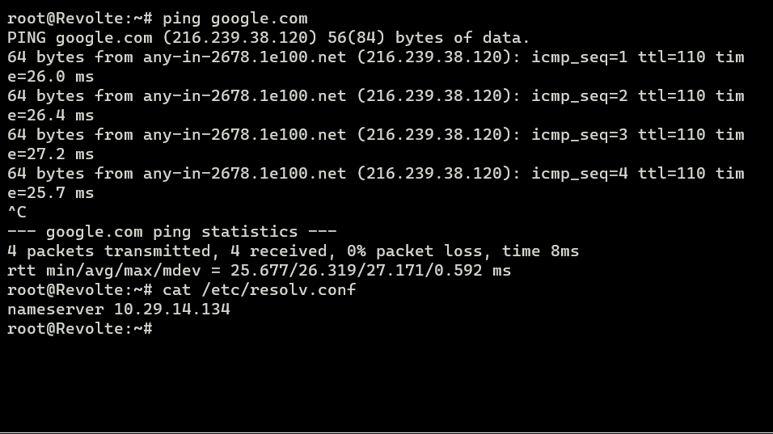

## Soal 2

Kalian diminta untuk melakukan drop semua TCP dan UDP kecuali port 8080 pada TCP.

Jawab:

Untuk melakukan drop semua TCP dan UDP kecuali port 8080 pada TCP, kita perlu melakukan setting pada salah satu web server yang kita ingin drop TCP dan UDP nya. pada khasus ini kita akan melakukan setting pada web server <code>Sein</code>

```
iptables -A INPUT -p tcp --dport 8080 -j ACCEPT
iptables -A INPUT -p tcp --dport 0:8079 -j DROP
iptables -A INPUT -p tcp --dport 8081:65535 -j DROP
iptables -A INPUT -p udp -j DROP
```

Testing:

Akses dns <code>its.jarkomd15.com</code> yang telah disetting pada dns server sebelumnya dengan port 80, kemudian lakukan dengan port 8080 dengan command:

port 80

```
$ lynx its.jarkomd15.com
```


```
$ lynx its.jarkomd15.com:8080
```

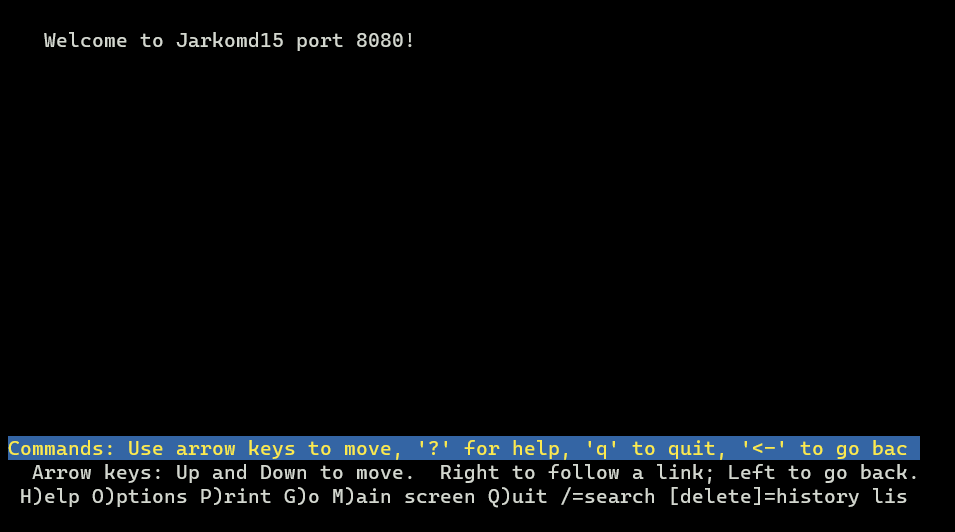

## Soal 3

Kepala Suku North Area meminta kalian untuk membatasi DHCP dan DNS Server hanya dapat dilakukan ping oleh maksimal 3 device secara bersamaan, selebihnya akan di drop.

Jawab:

Untuk membatasi DHCP dan DNS Server hanya dapat dilakukan ping oleh maksimal 3 device secara bersamaan, kita perlu melakukan setting iptables pada DHCP server (Revolte) dan DNS server (Richter) dengan konfigurasi sebagai berikut:

```
iptables -A INPUT -p icmp -m connlimit --connlimit-above 3 --connlimit-mask 0 -j DROP
```

Testing:

Kita perlu melakukan ping DNS atau DHCP server, pada kali ini kita akan testing DHCP server <code>Revolte</code> dengan menggunakan 3 device, kemudian 4 device

Hasil ping 3 device:

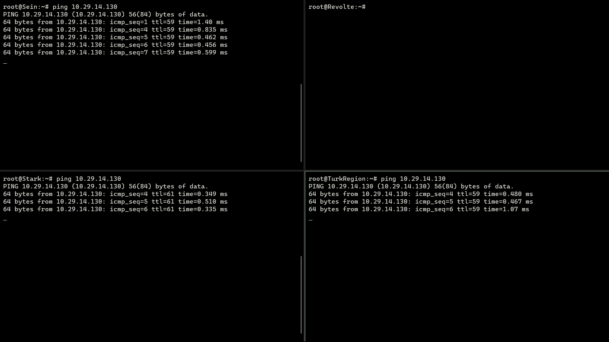

Dapat dilihat bahwa semua ping berjalan bersamaan

Hasil ping 4 device:

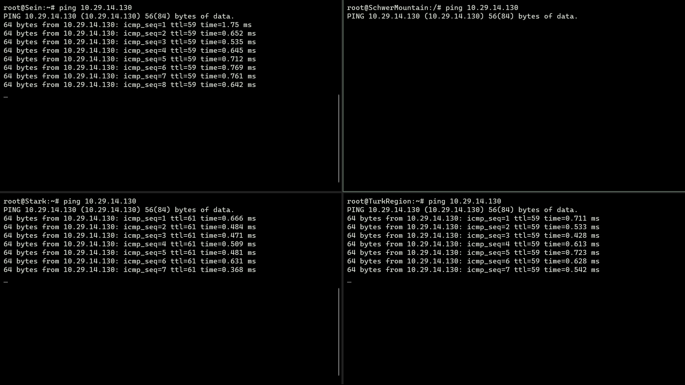

Dapat dilihat bahwa semua ping berhenti ketika device ke4 dijalankan pingnya

## Soal 4

Lakukan pembatasan sehingga koneksi SSH pada Web Server hanya dapat dilakukan oleh masyarakat yang berada pada GrobeForest.

Jawaban:

Untuk melakukan pembatasan sehingga koneksi SSH pada Web Server hanya dapat dilakukan oleh masyarakat yang berada pada GrobeForest, kita perlu melakukan config iptables pada salah satu web server (kali ini <code>Stark</code>)

```
# Izinkan koneksi SSH dari rentang IP yang ditentukan
iptables -A INPUT -p tcp --dport 22 -i eth0 -m iprange --src-range 10.29.8.2-10.29.11.254 -j ACCEPT

# Putuskan koneksi SSH dari alamat IP lain
iptables -A INPUT -p tcp --dport 22 -i eth0 -j DROP
```

Testing:

pada GrobeForest, Stark, dan salah satu host lain, kita perlu install netcat

```
apt-get install netcat -y
```

Jalankan command berikut pada Stark:

```
$ nc -l -p 22
```

Jalankan command berikut pada GrobeForest dan salah satu host lain:

```
nc 10.29.14.142 22
```

berikut merupakan hasil testing pada Grobeforest:

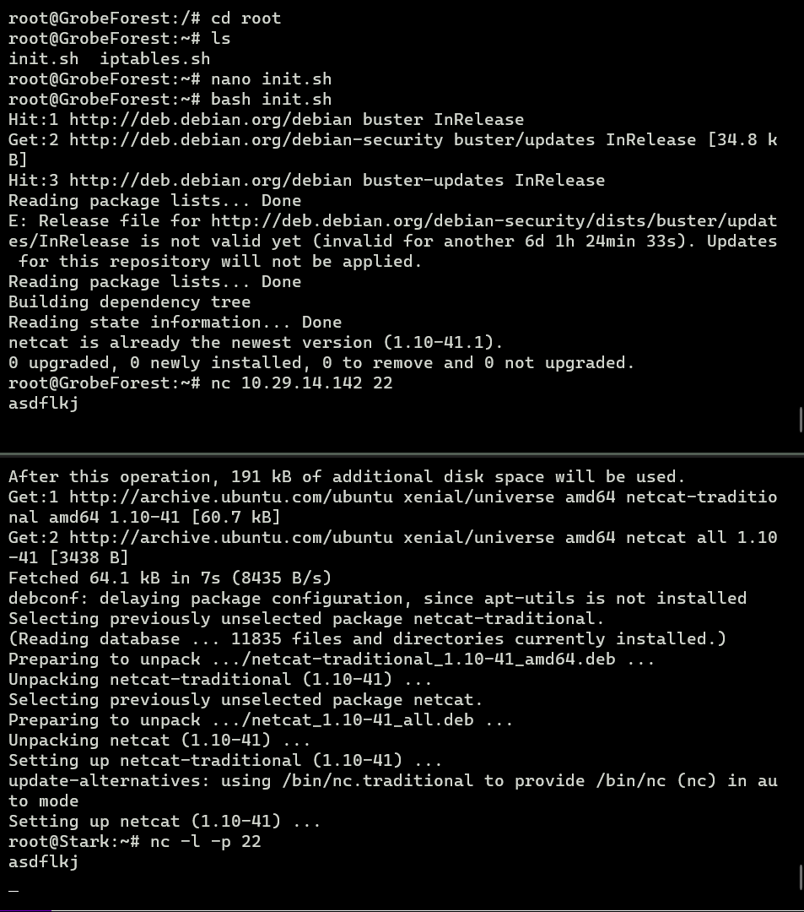

berikut merupakan hasil testing selain dengan menggunakan Grobeforest atau Sein:

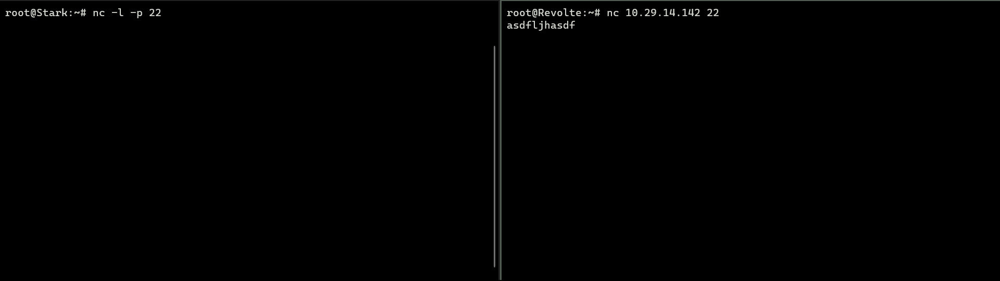

## Soal 5

Selain itu, akses menuju WebServer hanya diperbolehkan saat jam kerja yaitu Senin-Jumat pada pukul 08.00-16.00.

Jawab:

Agar akses menuju WebServer hanya diperbolehkan saat jam kerja yaitu Senin-Jumat pada pukul 08.00-16.00, kita perlu setting iptables config di web server (Sein dan Stark)

```
# Izinkan traffic masuk pada hari kerja (Senin-Jumat) mulai pukul 08:00 hingga 16:00
iptables -A INPUT -m time --timestart 08:00 --timestop 16:00 --weekdays Mon,Tue,Wed,Thu,Fri -j ACCEPT

# Drop semua traffic masuk lainnya
iptables -A INPUT -j DROP
```

Testing:

Untuk melakukan testing, kita perlu merubah waktu pada host yang digunakan untuk testing ke waktu yang tidak diperbolehkan untuk mengakses server

```
$ date -s "20 DEC 2023 06:00:00"
```

dapat dilihat bahwa tidak ada respons dari server

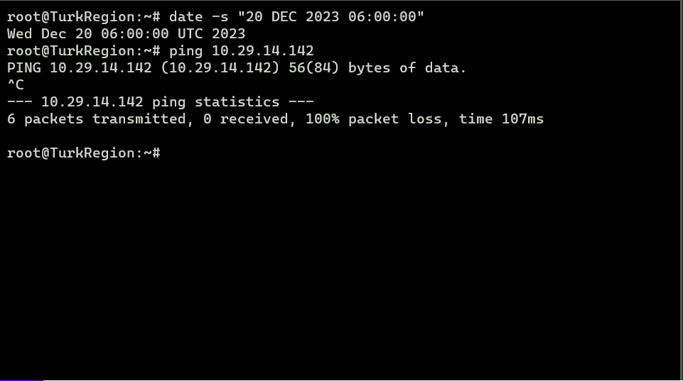

kemudian kita ubah lagi ke waktu yang diperbolehkan untuk mengakses server

```
$ date -s "20 DEC 2023 09:00:00"
```

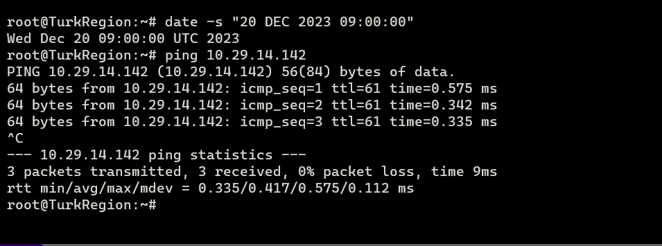

dapat dilihat bahwa ada respons dari server

## Soal 6

Lalu, karena ternyata terdapat beberapa waktu di mana network administrator dari WebServer tidak bisa stand by, sehingga perlu ditambahkan rule bahwa akses pada hari Senin - Kamis pada jam 12.00 - 13.00 dilarang (istirahat maksi cuy) dan akses di hari Jumat pada jam 11.00 - 13.00 juga dilarang (maklum, Jumatan rek).

> Jawab:

Agar akses pada hari Senin - Kamis pada jam 12.00 - 13.00 dilarang (istirahat maksi cuy) dan akses di hari Jumat pada jam 11.00 - 13.00 juga dilarang (maklum, Jumatan rek) pada WebServer, kita perlu melakukan konfigurasi iptables pada Web Server (Sein dan Stark)

```
# Senin hingga Kamis dari 12:00 hingga 13:00 dilarang
iptables -A INPUT -m time --timestart 12:00 --timestop 13:00 --weekdays Mon,Tue,Wed,Thu -j DROP

# Jumat dari 11:00 hingga 13:00 dilarang
iptables -A INPUT -m time --timestart 11:00 --timestop 13:00 --weekdays Fri -j DROP

# Izinkan traffic masuk pada hari kerja (Senin-Jumat) mulai pukul 08:00 hingga 16:00
iptables -A INPUT -m time --timestart 08:00 --timestop 16:00 --weekdays Mon,Tue,Wed,Thu,Fri -j ACCEPT

# Drop semua traffic masuk lainnya
iptables -A INPUT -j DROP
```

berikut merupakan konfigurasi waktu lengkap web server:

```
# Senin hingga Kamis dari 12:00 hingga 13:00 dilarang
iptables -A INPUT -m time --timestart 12:00 --timestop 13:00 --weekdays Mon,Tue,Wed,Thu -j DROP

# Jumat dari 11:00 hingga 13:00 dilarang
iptables -A INPUT -m time --timestart 11:00 --timestop 13:00 --weekdays Fri -j DROP

# Izinkan traffic masuk pada hari kerja (Senin-Jumat) mulai pukul 08:00 hingga 16:00
iptables -A INPUT -m time --timestart 08:00 --timestop 16:00 --weekdays Mon,Tue,Wed,Thu,Fri -j ACCEPT

# Drop semua traffic masuk lainnya
iptables -A INPUT -j DROP
```

> Testing:

Kali ini kita akan coba testing menggunakan TurkRegion (host)

pertama, kita perlu setting waktu pada pukul 12:30 pada hari kamis, lalu lakukan ping ke Stark (web server)

```
$ date -s "21 DEC 2023 12:30:00"
$ ping 10.29.14.142
```

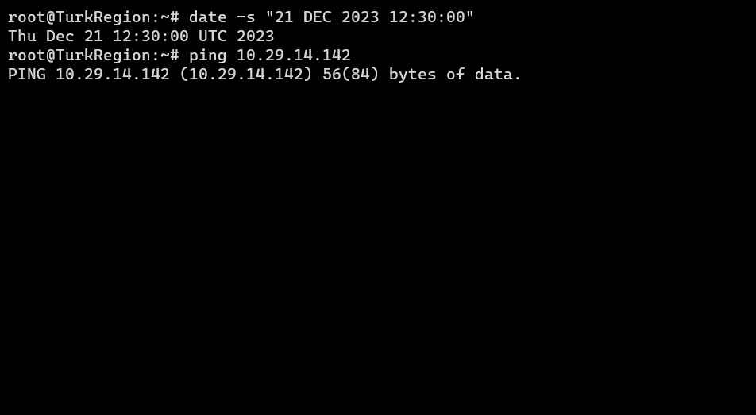

Dapat dilihat karena testing diadakan pada hari kamis pukul 12:30 dia gagal melakukan ping

kemudian, kita perlu setting waktu pada pukul 11:30 pada hari jumat, lalu lakukan ping ke Stark (web server)

```
$ date -s "22 DEC 2023 11:30:00"
$ ping 10.29.14.142
```

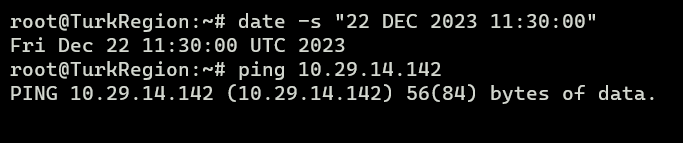

Dapat dilihat karena testing diadakan pada hari jumat tetapi pukul 11:30 dia gagal melakukan ping

kemudian, kita perlu setting waktu pada pukul 09:00 pada hari jumat, lalu lakukan ping ke Stark (web server)

```
$ date -s "22 DEC 2023 09:00:00"
$ ping 10.29.14.142
```

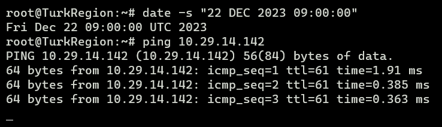

Dapat dilihat karena testing diadakan pada hari jumat tetapi pukul 09:00 dia berhasil melakukan ping

## Soal 7

Karena terdapat 2 WebServer, kalian diminta agar setiap client yang mengakses Sein dengan Port 80 akan didistribusikan secara bergantian pada Sein dan Stark secara berurutan dan request dari client yang mengakses Stark dengan port 443 akan didistribusikan secara bergantian pada Sein dan Stark secara berurutan.

## Soal 8

Karena berbeda koalisi politik, maka subnet dengan masyarakat yang berada pada Revolte dilarang keras mengakses WebServer hingga masa pencoblosan pemilu kepala suku 2024 berakhir. Masa pemilu (hingga pemungutan dan penghitungan suara selesai) kepala suku bersamaan dengan masa pemilu Presiden dan Wakil Presiden Indonesia 2024.

Masa pemilu berakhir (termasuk penghitungan suara): 20 Maret 2024

Perintah iptables yang membatasi akses ke 10.29.14.142 dan 10.29.8.2 dari 10.29.14.129/30 hingga 20 Maret 2024:

```
# Secara default mengizinkan semua akses
iptables -A INPUT -j ACCEPT

# Izinkan traffic dari IP tertentu kecuali rentang yang ditentukan dan setelah 20 Maret 2024
iptables -A INPUT -s 10.29.14.142 -j ACCEPT
iptables -A INPUT -s 10.29.8.2 -j ACCEPT
iptables -A INPUT -s 10.29.14.129/30 -m time --datestop 2024-03-20 -j DROP
iptables -A INPUT -s 10.29.14.129/30 -j ACCEPT

# Drop semua traffic lain
iptables -A INPUT -j DROP
```

## Soal 9

Sadar akan adanya potensial saling serang antar kubu politik, maka WebServer harus dapat secara otomatis memblokir alamat IP yang melakukan scanning port dalam jumlah banyak (maksimal 20 scan port) di dalam selang waktu 10 menit. (clue: test dengan nmap)

```
# Buat chain untuk melacak potensi pemindaian port
iptables -N PORTSCAN
iptables -A PORTSCAN -m recent --name PORTSCAN --set -j ACCEPT

# Check incoming TCP packets, track port scanning (assuming port 80 for illustration)
iptables -A INPUT -p tcp --dport 80 -m recent --name PORTSCAN --rcheck --seconds 600 --hitcount 20 -j LOG --log-prefix "Portscan detected: "
iptables -A INPUT -p tcp --dport 80 -m recent --name PORTSCAN --rcheck --seconds 600 --hitcount 20 -j DROP

# Allow legitimate traffic
iptables -A INPUT -p tcp --dport 80 -j ACCEPT
```

## Soal 10

Karena kepala suku ingin tau paket apa saja yang di-drop, maka di setiap node server dan router ditambahkan logging paket yang di-drop dengan standard syslog level.

```
# Log paket yang didrop ke syslog
iptables -A INPUT -j LOG --log-prefix "Paket yang didrop: " --log-level 6
iptables -A OUTPUT -j LOG --log-prefix "Paket yang didrop: " --log-level 6
iptables -A FORWARD -j LOG --log-prefix "Paket yang didrop: " --log-level 6
```
